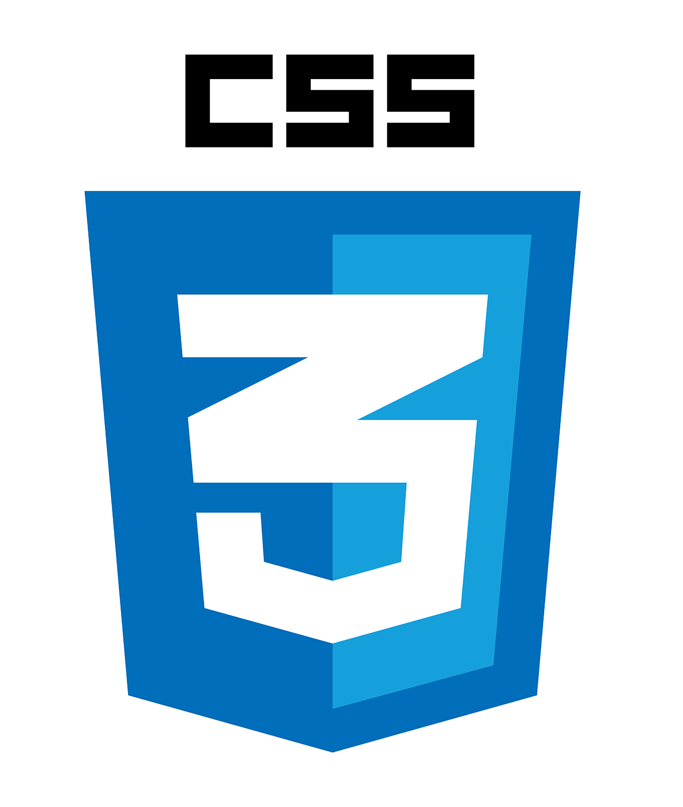
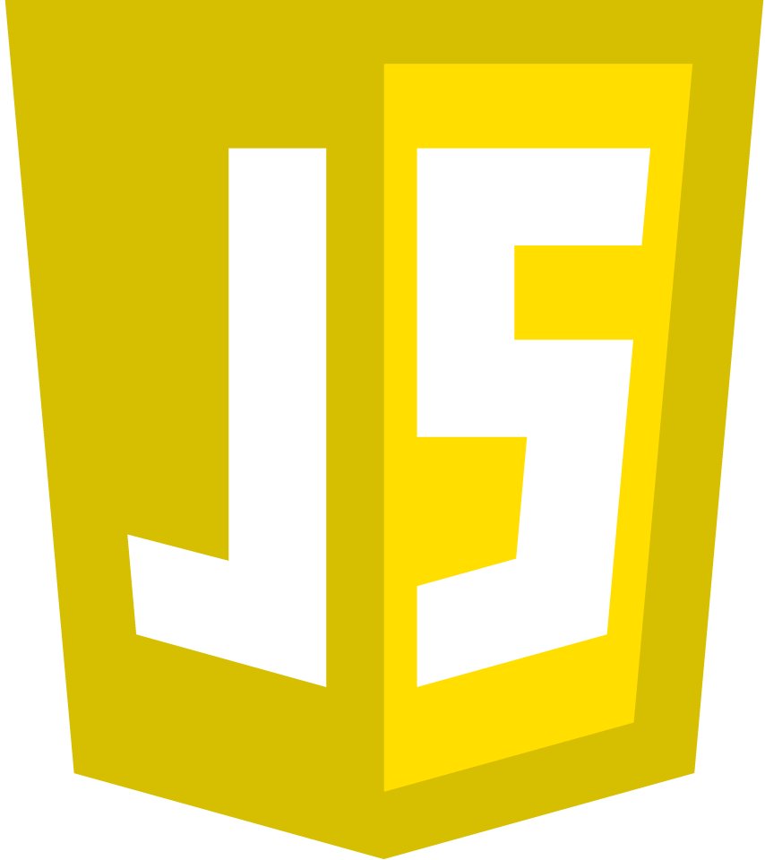
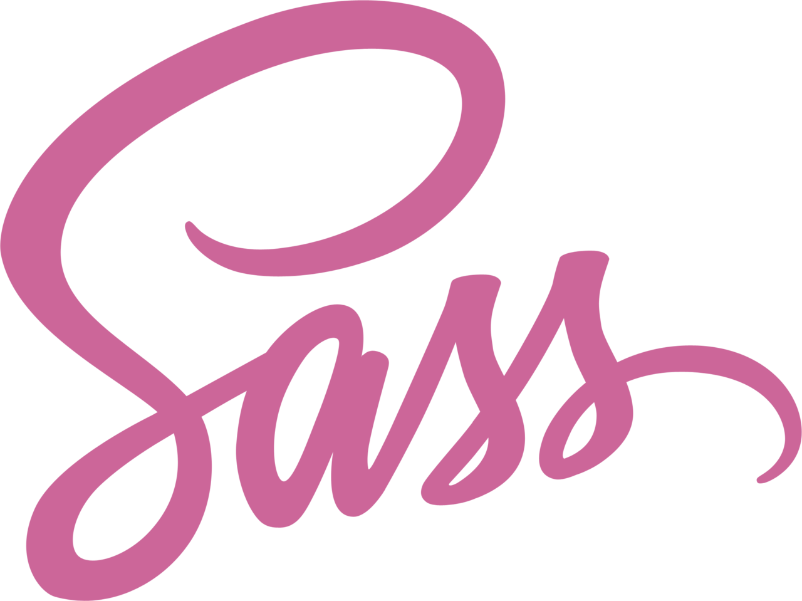
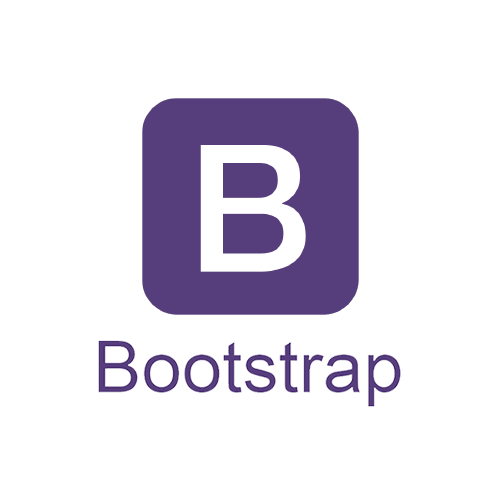
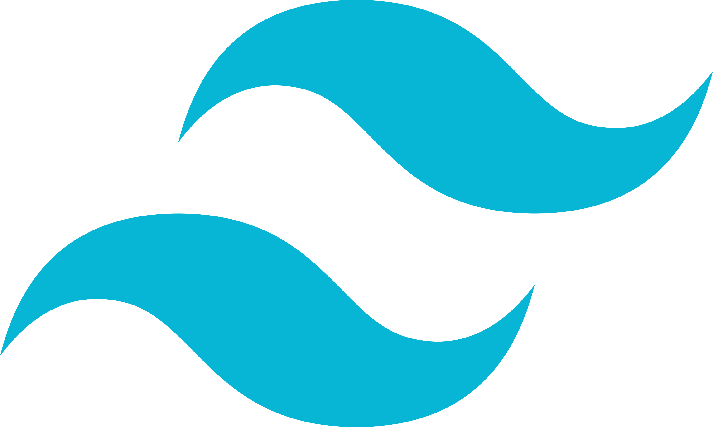

### Hello world, this is Metis Teng 🌱

## About Me

I'm a Taiwanese self-taught front-end developer base in Brisbane, Australia 🇹🇼 🇦🇺. I am open to freelance projects, if you have cool ideas in mind.

 

GET IN TOUCH

 

## Fun Facts of me

🪕 Traditional trained Taiwanese and Chinese Classical musician
 
🏀 Basketball Enthuthist
 
☕️ Caffeine addictive
 
🥑 Vegan
 
🥁 Sound Maker

### 2022 Goals

🦉 Sleep 7 hours
 
📌 Become a experienced front-end dev in 2022.

### Languages and Tools

 

## My Github breakdown

### Highlighted Projects

I took project-based learning process. Here are some of the highlights. Have Fun!
 
 

### Most used languages

## Acknowledgement

### Typing animation in this profile

[readme-typing-svg](https://github.com/DenverCoder1/readme-typing-svg)

### Github-readme-stats

[github-readme-stats](https://github.com/anuraghazra/github-readme-stats)

### Heros and platforms I learnt from during career changing year(s).

- [FreeCodeCamp](https://www.freecodecamp.org)
- [Frontdnd Mentor](https://www.frontendmentor.io/profile/greatmetis)
- [Hahow-動畫互動網頁特效入門（JS/CANVAS](https://hahow.in/courses/586fae97a8aae907000ce721/main)
- [六角學院-Javascript 工程師養成直播班](https://www.hexschool.com/courses/js-training.html)
- [The Net Ninja](https://www.youtube.com/c/TheNetNinja)
- [Traversy Media](https://www.youtube.com/c/TraversyMedia)
- [Coder Coder](https://www.youtube.com/c/TheCoderCoder)
